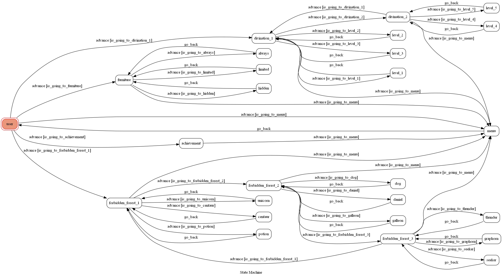

# Line聊天機器人 -- 哈利波特:魔法覺醒 攻略
霍格華茲的學生絕不認輸!

## 環境
* windows
* anaconda
* python 3.6
* ngrok/Heroku

## 設定

### 安裝相關套件

#### anaconda
```
conda install -c conda-forge pygraphviz

pip install flask python-dotenv line-bot-sdk transitions pygraphviz
```

#### ngrok
下載ngrok <br>
在ngrok輸入: `ngrok http 8000` <br>
在terminal執行: `python app.py` <br>

#### Heroku
下載Heroku CLI: https://devcenter.heroku.com/articles/heroku-cli <br>
註冊Heroku帳號: https://signup.heroku.com <br>
在Heroku網站Create new app <br>
在terminal登入Heroku CLI: `heroku login` <br>
如果無法辨識heroku: `set PATH=%PATH%;C:\Program Files\heroku\bin`(heroku路徑) <br>
設定line環境
```
heroku config:set LINE_CHANNEL_SECRET=[YOUR_LINE_CHANNEL_SECRET]

heroku config:set LINE_CHANNEL_ACCESS_TOKEN=[YOUR_LINE_CHANNEL_ACCESS_TOKEN]
```
放上Heroku
```
heroku git:remote -a [HEROKU_APP_NAME]

git add .

git commit -m "Add code"

git push -f heroku master
```
如果push時顯示pygraphviz安裝失敗
```
heroku buildpacks:set heroku/python

heroku buildpacks:add --index 1 heroku-community/apt
```
在line的webhook url輸入: `[HEROKU_APP_NAME].herokuapp.com/webhook` <br>
debug輸入: `heroku logs --tail --app [HEROKU_APP_NAME]` <br>

## Finite State Machine


## 實作
起因: 每次都要上網查攻略很麻煩, 而且有些攻略資訊有誤, 於是透過本次作業將正確的攻略整合在一起, 方便查詢! <br>

初始state為"user" <br>
"user"可以去到"achievement", "furniture", "divination_1", "forbidden_forest_1", "menu" <br>
隨時都可以輸入「fsm」「主選單」 <br>


### achievement 神秘成就

#### 架構
* 神秘成就
	* 自強不息
	* 福來再現
	* 不幸成真
	* 無期徒刑
	* 夜遊之神
	* 魔法史先驅
	* 魁地奇之星
	* 巨蛛殺手

#### line畫面


### furniture 大世界收集

#### 架構
* 大世界收集
	* 常駐款
		* 學院
		* 經典
		* 糖果主題
		* 禁忌森林主題
	* 限定款
		* 魔藥狂熱
		* 兩腳蛇迷蹤
		* 萬聖節主題
		* 冰雪主題
		* 聖誕主題
		* 煙火主題
	* 隱藏款
		* 碧藍深海
		* 釀造榮譽
		* 魔法時鐘
		* 龍蛋標本
		* 水晶球
		* 飛天掃帚
		* 結網蜘蛛
		* 紫角獸地毯

#### line畫面


### divination 占卜學圖鑑
~幸好在project deadline前成功解完, 我好好看~

#### 架構
* 占卜學圖鑑/上一輪
	* 難度1
	* 難度2
	* 難度3
	* 下一輪
* 下一輪
	* 難度4
	* 難度5
	* 上一輪

#### line畫面


### forbidden_forest 禁忌森林

#### 架構
* 禁忌森林/第一批線索
	* 尋訪人馬
	* 魔藥事故
	* 追尋獨角獸
	* 第二批線索
* 第二批線索
	* 尋犬啟示
	* 丹尼爾的抉擇
	* 加隆竊賊
	* 第三批線索
* 第三批線索
	* 紫角獸之災
	* 跟隨閃電
	* 搜尋搜捕手
	* 第一批線索

#### line畫面


